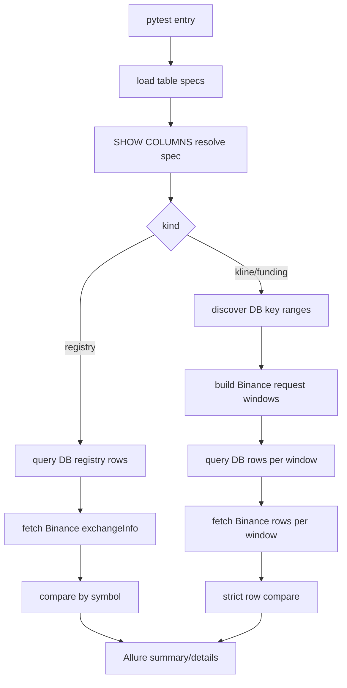
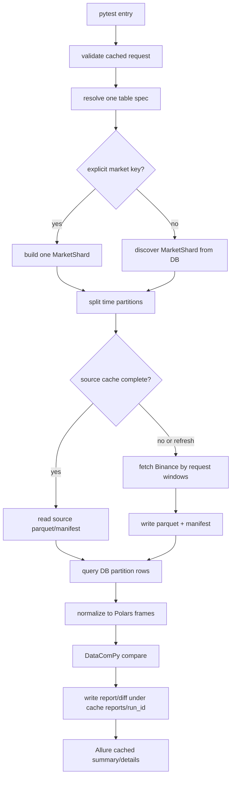

# Binance 数据库与上游数据准确性对比脚本使用文档

本文档说明 `tests/db_accuracy/integration/test_binance_db_accuracy.py` 这套手动校验脚本的能力、适用场景、运行方式、参数含义、报告产物和排错方法。

该脚本用于把 MySQL 中的 Binance raw/metadata 数据与 Binance REST 上游源数据做严格对账。它默认不参与普通 CI，只有显式传入 `--run-db-accuracy` 时才会执行。

## 适用场景

使用这套脚本处理下面几类问题：

- 验证数据库中的 Binance Kline、Funding、交割合约、合约元数据是否与 Binance 上游一致。
- 针对某张表、某个市场、某个 interval、某段时间做定向复核。
- 对大表分批校验，例如 `binance_kline_all_future_raw` 这种数亿行级别的 raw 表。
- 把 Binance 上游数据按市场和时间分片缓存到本地，后续重复对比时复用缓存，减少 REST 请求。
- 生成 DataComPy 文本报告和 JSON diff，定位 DB-only、source-only、字段值不一致等问题。

不建议用这套脚本处理：

- 普通单元测试或默认 CI 回归。
- clean/curated 表、CoinGlass 表、DQC 问题表、修复表、业务汇总表。
- 没有稳定 DB 连接或没有 Binance REST 访问能力的环境。

## 核心功能

### 1. direct 全历史校验模式

`direct` 是默认模式。它从配置表中读取需要校验的所有表，对每张表扫描数据库中的稳定历史范围，并按 Binance REST 请求限制拆分窗口后逐段比较。

特点：

- 支持一次跑所有已配置表。
- 支持用 `--db-accuracy-table` 限定一张或多张表。
- 对时间序列表按 DB 中实际存在的市场 key 发现范围。
- 对 metadata/registry 表一次性比较全表。
- 输出 Allure 附件 `db_accuracy_summary` 和 `db_accuracy_details`。

适合：

- 小表或中等数据量表。
- 需要完整扫描配置范围的人工验收。
- `binance_futures_symbols` 这类 metadata 表。

不适合：

- 数亿行级别大表的一次性全历史对比。
- 需要随时指定某个市场、某个时间段反复对比的场景。

### 2. cached 范围分片校验模式

`cached` 是大表优先使用的模式。它要求明确指定一张表和时间范围，然后把校验拆成：

```text
市场分片 + 时间分区
```

每个分片的流程是：

1. 计算市场 shard，例如 `symbol + interval` 或 `pair + contract_type + interval`。
2. 按 `--db-accuracy-partition-days` 切时间分区。
3. 对每个分区拉 Binance 上游数据。
4. Binance 上游数据写入本地 Parquet 和 manifest。
5. 查询同一市场、同一时间分区内的 DB 数据。
6. 用 Polars DataFrame 归一化 DB 和 source。
7. 用 DataComPy 生成文本报告，并额外生成 JSON diff 摘要。

特点：

- 支持按市场、interval、合约类型、时间范围定向对比。
- 支持 DB 自动发现市场 shard，并用 `--db-accuracy-max-shards` 控制数量。
- Binance 源数据本地缓存，默认不重复请求已完成分区。
- 缓存按市场和日期分目录，避免单文件过大。
- 报告按 `run_id` 分目录，重复运行不会覆盖旧报告。
- 对已下架或上游不可用市场会记录 manifest 状态，不会把这类失败伪装成成功。

适合：

- 大表。
- 指定时间范围的抽样、复核、回归。
- 先拉源数据到本地，再多次和 DB 对比。
- 已知某个市场或某个日期有问题，需要反复定位。

## 执行入口

唯一 pytest 入口：

```bash
/Users/wrh/.pyenv/versions/3.12.0/bin/python -m pytest tests/db_accuracy/integration/test_binance_db_accuracy.py -v --run-db-accuracy
```

项目 `.python-version` 是 `3.12.0`。建议固定使用本机 Python 3.12：

```bash
PYTHON=/Users/wrh/.pyenv/versions/3.12.0/bin/python
```

后续命令都可以写成：

```bash
$PYTHON -m pytest tests/db_accuracy/integration/test_binance_db_accuracy.py -v --run-db-accuracy
```

## 环境前置条件

### Python 依赖

`requirements.txt` 中与该脚本直接相关的依赖包括：

- `pytest`
- `pymysql`
- `requests`
- `datacompy`
- `pandas`
- `polars`
- `pyarrow`
- `allure-pytest`

安装：

```bash
/Users/wrh/.pyenv/versions/3.12.0/bin/python -m pip install -r requirements.txt
```

### 配置要求

运行时需要正常的项目环境配置：

- `--env` 对应的 `.env` 配置存在。
- `infrastructure.database.db_client.DBClient` 能连接目标 MySQL。
- Binance API base URL 配置正确。
- 当前网络能访问 Binance REST。

示例：

```bash
$PYTHON -m pytest tests/db_accuracy/integration/test_binance_db_accuracy.py -v \
  --env=test \
  --run-db-accuracy \
  --db-accuracy-table binance_futures_symbols
```

## 支持的表

表配置在 `data/binance_db_accuracy_tables.yaml` 中。当前支持：

| 表名 | 类型 | 上游 endpoint | 市场 key | 时间字段候选 |
|---|---|---|---|---|
| `kline_data_future_raw` | kline | `usdm_klines` | `symbol, interval` | `timestamp, open_time` |
| `kline_data_spot_raw` | kline | `spot_klines` | `symbol, interval` | `timestamp, open_time` |
| `binance_usdm_funding_rate_raw` | funding | `usdm_funding` | `symbol` | `funding_time, timestamp` |
| `binance_kline_all_future_raw` | kline | `usdm_klines` | `symbol, interval` | `timestamp, open_time` |
| `binance_funding_rate_all_future_raw` | funding | `usdm_funding` | `symbol` | `funding_time, timestamp` |
| `binance_kline_all_future_raw_1h` | kline | `usdm_klines` | `symbol` | `timestamp, open_time` |
| `binance_1h_usdm_kline_raw` | kline | `usdm_klines` | `symbol` | `timestamp, open_time` |
| `binance_1h_usdm_funding_rate_raw` | funding | `usdm_funding` | `symbol` | `funding_time, timestamp` |
| `binance_kline_coinm_perp_raw` | kline | `coinm_klines` | `symbol, interval` | `timestamp, open_time` |
| `binance_kline_coinm_delivery_raw` | kline | `coinm_continuous_klines` | `pair, contract_type, interval` | `timestamp, open_time` |
| `binance_funding_rate_coinm_perp_raw` | funding | `coinm_funding` | `symbol` | `funding_time, timestamp` |
| `binance_kline_usdm_delivery_raw` | kline | `usdm_continuous_klines` | `pair, contract_type, interval` | `timestamp, open_time` |
| `binance_futures_symbols` | registry | `usdm_exchange_info` | `symbol` | 无 |

固定 1h 表使用 `fixed_interval: 1h`，运行 cached 模式时不需要传 `--db-accuracy-interval` 作为 key，但如果表本身没有 interval key，传了也不会参与显式市场 key。

## 参数参考

### 通用参数

| 参数 | 默认值 | 适用模式 | 说明 |
|---|---:|---|---|
| `--run-db-accuracy` | `False` | direct/cached | 必须显式传入，否则 `db_accuracy` 测试会被跳过。 |
| `--env` | `test` | direct/cached | 选择项目环境配置。 |
| `--db-accuracy-mode` | `direct` | direct/cached | 执行模式，可选 `direct` 或 `cached`。 |
| `--db-accuracy-table` | `[]` | direct/cached | 限定表。direct 可传多个；cached 必须且只能传一个。 |

### direct 模式参数

| 参数 | 默认值 | 说明 |
|---|---:|---|
| `--db-accuracy-safety-hours` | `24` | 只校验当前时间往前至少 N 小时之前的稳定数据，避免近期数据仍在写入或 Binance 上游仍在变化。 |

### cached 模式参数

| 参数 | 默认值 | 说明 |
|---|---:|---|
| `--db-accuracy-cache-root` | `.cache/binance_accuracy` | Binance 源数据缓存和本地报告根目录。大表建议放到大容量磁盘。 |
| `--db-accuracy-symbol` | `[]` | 限定 symbol，例如 `BTCUSDT`。显式市场模式每次只能传一个。自动发现模式可作为过滤条件，但也只支持一个值。 |
| `--db-accuracy-pair` | `[]` | 限定 delivery/continuous kline 的 pair，例如 `BTCUSDT` 或 `BTCUSD`。 |
| `--db-accuracy-contract-type` | `[]` | 限定 delivery/continuous kline 的合约类型，例如 `CURRENT_QUARTER`。 |
| `--db-accuracy-interval` | `[]` | 限定 kline interval，例如 `1m`, `5m`, `1h`。 |
| `--db-accuracy-start-ms` | `None` | 起始时间戳，毫秒，闭区间。cached 必填。 |
| `--db-accuracy-end-ms` | `None` | 结束时间戳，毫秒，闭区间。cached 必填。 |
| `--db-accuracy-partition-days` | `1` | DB/source 对比的时间分区大小，单位天，必须大于等于 1。 |
| `--db-accuracy-refresh-cache` | `False` | 强制刷新 Binance 源数据缓存。 |
| `--db-accuracy-max-shards` | `100` | DB 自动发现市场分片时最多处理多少个 shard，必须大于等于 1。 |

## 快速开始

### 1. 跑一张 metadata 表

`binance_futures_symbols` 数据量小，适合作为连通性检查：

```bash
$PYTHON -m pytest tests/db_accuracy/integration/test_binance_db_accuracy.py -v \
  --env=test \
  --run-db-accuracy \
  --db-accuracy-table binance_futures_symbols
```

预期：

- 能连接 MySQL。
- 能请求 Binance USDM `exchangeInfo`。
- Allure 中有 `db_accuracy_summary` 和 `db_accuracy_details`。

### 2. direct 模式跑指定 raw 表

```bash
$PYTHON -m pytest tests/db_accuracy/integration/test_binance_db_accuracy.py -v \
  --env=test \
  --run-db-accuracy \
  --db-accuracy-mode direct \
  --db-accuracy-table binance_1h_usdm_kline_raw
```

direct 会扫描 DB 中该表每个市场的稳定历史范围，并按 Binance request limit 拆请求窗口。

### 3. direct 模式调大稳定窗口

如果近期数据写入有延迟，或 Binance 近期数据还可能变化，把稳定窗口从默认 24 小时改成 48 小时：

```bash
$PYTHON -m pytest tests/db_accuracy/integration/test_binance_db_accuracy.py -v \
  --env=test \
  --run-db-accuracy \
  --db-accuracy-mode direct \
  --db-accuracy-safety-hours 48 \
  --db-accuracy-table binance_1h_usdm_kline_raw
```

## cached 模式使用方法

### 1. 显式校验一个 USDM Kline 市场

例如校验 `binance_kline_all_future_raw` 中 `BTCUSDT + 1m` 在 2024-01-01 这一天的数据：

```bash
$PYTHON -m pytest tests/db_accuracy/integration/test_binance_db_accuracy.py -v \
  --env=test \
  --run-db-accuracy \
  --db-accuracy-mode cached \
  --db-accuracy-table binance_kline_all_future_raw \
  --db-accuracy-symbol BTCUSDT \
  --db-accuracy-interval 1m \
  --db-accuracy-start-ms 1704067200000 \
  --db-accuracy-end-ms 1704153599999
```

说明：

- 一天 `1m` Kline 理论上 1440 根。
- Binance 单次 kline 请求 `limit=1000`，脚本会自动把源端请求拆成两段。
- 本地缓存按 `symbol=BTCUSDT/interval=1m/date=2024-01-01` 保存。

### 2. 显式校验一个 Funding 市场

```bash
$PYTHON -m pytest tests/db_accuracy/integration/test_binance_db_accuracy.py -v \
  --env=test \
  --run-db-accuracy \
  --db-accuracy-mode cached \
  --db-accuracy-table binance_funding_rate_all_future_raw \
  --db-accuracy-symbol BTCUSDT \
  --db-accuracy-start-ms 1704067200000 \
  --db-accuracy-end-ms 1706745599999
```

Funding 表的市场 key 只有 `symbol`。源端请求窗口按 90 天规划。

### 3. 显式校验 USDM delivery/continuous Kline

```bash
$PYTHON -m pytest tests/db_accuracy/integration/test_binance_db_accuracy.py -v \
  --env=test \
  --run-db-accuracy \
  --db-accuracy-mode cached \
  --db-accuracy-table binance_kline_usdm_delivery_raw \
  --db-accuracy-pair BTCUSDT \
  --db-accuracy-contract-type CURRENT_QUARTER \
  --db-accuracy-interval 1h \
  --db-accuracy-start-ms 1704067200000 \
  --db-accuracy-end-ms 1706745599999
```

Delivery/continuous Kline 的完整市场 key 是：

```text
pair + contract_type + interval
```

### 4. 显式校验 COIN-M perpetual Kline

```bash
$PYTHON -m pytest tests/db_accuracy/integration/test_binance_db_accuracy.py -v \
  --env=test \
  --run-db-accuracy \
  --db-accuracy-mode cached \
  --db-accuracy-table binance_kline_coinm_perp_raw \
  --db-accuracy-symbol BTCUSD_PERP \
  --db-accuracy-interval 1h \
  --db-accuracy-start-ms 1704067200000 \
  --db-accuracy-end-ms 1706745599999
```

COIN-M Kline 会额外遵守 Binance 的 200 天请求窗口上限。

### 5. 从 DB 自动发现市场 shard

如果不传完整市场 key，cached 模式会从 DB 里按 key fields 自动 `GROUP BY` 发现市场分片。

例如发现 `binance_kline_all_future_raw` 中 interval 为 `1m` 的前 20 个市场：

```bash
$PYTHON -m pytest tests/db_accuracy/integration/test_binance_db_accuracy.py -v \
  --env=test \
  --run-db-accuracy \
  --db-accuracy-mode cached \
  --db-accuracy-table binance_kline_all_future_raw \
  --db-accuracy-interval 1m \
  --db-accuracy-start-ms 1704067200000 \
  --db-accuracy-end-ms 1704153599999 \
  --db-accuracy-max-shards 20
```

自动发现会执行类似下面的逻辑：

```sql
SELECT symbol, interval
FROM binance_kline_all_future_raw
WHERE timestamp >= %s AND timestamp <= %s
  AND interval = %s
GROUP BY symbol, interval
ORDER BY symbol, interval
LIMIT 20
```

如果没有发现任何 shard，脚本会失败并报告 `no_shards_discovered`，避免空跑误判成功。

### 6. 使用更大的缓存磁盘

大表缓存建议不要放在项目目录。可以指定外部磁盘路径：

```bash
$PYTHON -m pytest tests/db_accuracy/integration/test_binance_db_accuracy.py -v \
  --env=test \
  --run-db-accuracy \
  --db-accuracy-mode cached \
  --db-accuracy-table binance_kline_all_future_raw \
  --db-accuracy-symbol BTCUSDT \
  --db-accuracy-interval 1m \
  --db-accuracy-start-ms 1704067200000 \
  --db-accuracy-end-ms 1704153599999 \
  --db-accuracy-cache-root /Volumes/BigDisk/binance_accuracy_cache
```

### 7. 强制刷新 Binance 源数据缓存

默认情况下，已完成的缓存分区会复用，不重复请求 Binance。需要重新拉源数据时：

```bash
$PYTHON -m pytest tests/db_accuracy/integration/test_binance_db_accuracy.py -v \
  --env=test \
  --run-db-accuracy \
  --db-accuracy-mode cached \
  --db-accuracy-table binance_kline_all_future_raw \
  --db-accuracy-symbol BTCUSDT \
  --db-accuracy-interval 1m \
  --db-accuracy-start-ms 1704067200000 \
  --db-accuracy-end-ms 1704153599999 \
  --db-accuracy-refresh-cache
```

## direct 与 cached 如何选择

| 场景 | 推荐模式 | 原因 |
|---|---|---|
| 小表、metadata 表 | direct | 简单，一次跑完整表。 |
| 想跑所有配置表做人工验收 | direct | direct 支持多表和全配置扫描。 |
| 数千万或数亿行 raw 表 | cached | 可以按市场和时间切片，并复用本地源数据。 |
| 只想看某个 symbol 某一天 | cached | 指定范围更直接，报告更小。 |
| 想反复对同一段数据做对比 | cached | 上游源数据缓存后可以重复复用。 |
| 已下架市场较多 | cached | manifest 会记录不可用市场状态，便于逐个处理。 |

对于 `binance_kline_all_future_raw` 这类大表，优先使用 cached。不要直接尝试全表全历史 direct 跑完。

## 缓存和报告目录结构

默认根目录：

```text
.cache/binance_accuracy/
```

cached 模式会写两类内容：

```text
.cache/binance_accuracy/
  source/
    table=binance_kline_all_future_raw/
      symbol=BTCUSDT/
        interval=1m/
          date=2024-01-01/
            data.parquet
            manifest.json
  reports/
    run_id=20260519T030000123456Z/
      table=...__<hash>.report.txt
      table=...__<hash>.diff.json
```

### `data.parquet`

保存 Binance 上游源数据的归一化结果。它已经按 join columns 和 compare columns 整理，后续复用缓存时不需要重新请求 Binance。

### `manifest.json`

记录缓存分区状态：

| status | 含义 |
|---|---|
| `complete` | 源数据成功拉取并写入 `data.parquet`。 |
| `empty` | Binance 上游返回空数据。 |
| `source_market_unavailable` | 市场不存在、已下架、symbol/pair/contract 无效等。 |
| `source_request_failed` | 网络、限流、超时或其他源端请求失败。 |

`source_market_unavailable` 会被缓存复用。也就是说，除非传 `--db-accuracy-refresh-cache`，后续不会重复请求这个不可用市场。

### `.cache/binance_accuracy/reports/run_id=...`

每次 cached 运行都会生成一个新的 `run_id` 目录，避免覆盖历史报告。

每个 shard partition 会生成：

- `*.report.txt`: DataComPy 文本报告。
- `*.diff.json`: 结构化 diff 摘要。

`diff.json` 中包含：

- `db_only_count`: DB 有、Binance 源数据没有的行数。
- `source_only_count`: Binance 源数据有、DB 没有的行数。
- `unequal_count`: join key 相同但字段值不一致的行数。
- `db_only_sample`: 最多 20 条 DB-only 样例。
- `source_only_sample`: 最多 20 条 source-only 样例。
- `unequal_sample`: 最多 20 条字段不一致样例。

## Allure 附件

direct 模式输出：

- `db_accuracy_summary`: 每张表的窗口数、DB 行数、source 行数、差异数。
- `db_accuracy_details`: JSON 明细，包含每个 mismatch 的 reason。

cached 模式输出：

- `db_accuracy_cached_summary`: shard partition 汇总。
- `db_accuracy_cached_details`: JSON 明细，包含每个 shard partition 的状态、行数、差异数、报告路径、diff 路径和 message。

示例 summary：

```text
shards=1
passed=1
failed=0
skipped=0
db_rows=1440
source_rows=1440
differences=0
```

## 对比规则

### join key

direct 模式：

- 时间序列表按表配置的 key fields 和时间字段对齐。
- registry 表按 `symbol` 对齐。

cached 模式：

- join columns = 市场 key fields + resolved time field。
- 例如 `binance_kline_all_future_raw` 是 `symbol, interval, timestamp`。

### 字段比较

比较字段来自 `data/binance_db_accuracy_tables.yaml` 的：

- `compare_fields`: 必比字段。
- `optional_compare_fields`: DB 中存在时才比较。

### 数值归一化

数值按 Decimal 语义归一化：

- `1.2300` 和 `1.23` 视为相等。
- 整数、浮点、Decimal、数字字符串会转成同一种 canonical 形式。
- 不使用误差容忍度，归一化后不同就算不一致。

### 缺字段和重复 key

direct 模式会把缺字段、重复 row key 记录为 differences。

cached 模式会在 DataFrame 构建阶段校验 join key 唯一性。如果同一个 shard partition 中 join key 重复，会让该 shard partition 失败并在 message 中记录异常。

## 源端请求窗口规则

脚本不会无限制地请求 Binance。它会按表配置和 Binance 约束拆源端请求窗口。

Kline：

- 单次请求条数使用表配置的 `request_limit`，当前为 1000。
- 窗口跨度 = `interval_ms * request_limit`。
- 例如 `1m * 1000 = 1000 分钟`，所以完整一天 `1m` 会拆成 2 个请求。
- COIN-M Kline 额外限制最大 200 天窗口。

Funding：

- 按 90 天窗口拆分。
- 单次请求 `limit` 使用表配置的 `request_limit`。

Registry：

- 不按时间拆分，一次请求 exchange info。

## 大表推荐用法

以 `binance_kline_all_future_raw` 为例，表数据量非常大时不要一次跑全表。

推荐步骤：

1. 先选小范围验证链路。

   ```bash
   $PYTHON -m pytest tests/db_accuracy/integration/test_binance_db_accuracy.py -v \
     --env=test \
     --run-db-accuracy \
     --db-accuracy-mode cached \
     --db-accuracy-table binance_kline_all_future_raw \
     --db-accuracy-symbol BTCUSDT \
     --db-accuracy-interval 1m \
     --db-accuracy-start-ms 1704067200000 \
     --db-accuracy-end-ms 1704153599999
   ```

2. 再扩大时间范围，例如 7 天。

   ```bash
   $PYTHON -m pytest tests/db_accuracy/integration/test_binance_db_accuracy.py -v \
     --env=test \
     --run-db-accuracy \
     --db-accuracy-mode cached \
     --db-accuracy-table binance_kline_all_future_raw \
     --db-accuracy-symbol BTCUSDT \
     --db-accuracy-interval 1m \
     --db-accuracy-start-ms 1704067200000 \
     --db-accuracy-end-ms 1704671999999 \
     --db-accuracy-cache-root /Volumes/BigDisk/binance_accuracy_cache
   ```

3. 再用 DB discovery 批量发现市场，但限制 shard 数量。

   ```bash
   $PYTHON -m pytest tests/db_accuracy/integration/test_binance_db_accuracy.py -v \
     --env=test \
     --run-db-accuracy \
     --db-accuracy-mode cached \
     --db-accuracy-table binance_kline_all_future_raw \
     --db-accuracy-interval 1m \
     --db-accuracy-start-ms 1704067200000 \
     --db-accuracy-end-ms 1704153599999 \
     --db-accuracy-max-shards 50 \
     --db-accuracy-cache-root /Volumes/BigDisk/binance_accuracy_cache
   ```

4. 按日期或市场批量调度时，保持单次任务可控。

建议：

- `partition_days=1` 作为默认值即可，尤其是 `1m` 数据。
- 单次 `max_shards` 先从 10、20、50 逐步增加。
- 对已知下架市场，优先显式单市场跑，确认 manifest 状态。
- 缓存根目录放到大盘，不要放到仓库目录。
- 对比失败时先看 `diff.json`，再看 DataComPy `report.txt`。

## 常见命令模板

### 跑所有配置表

```bash
$PYTHON -m pytest tests/db_accuracy/integration/test_binance_db_accuracy.py -v \
  --env=test \
  --run-db-accuracy
```

### 跑多张指定表 direct

```bash
$PYTHON -m pytest tests/db_accuracy/integration/test_binance_db_accuracy.py -v \
  --env=test \
  --run-db-accuracy \
  --db-accuracy-table binance_futures_symbols \
  --db-accuracy-table binance_1h_usdm_kline_raw
```

### cached 跑固定 1h 表

```bash
$PYTHON -m pytest tests/db_accuracy/integration/test_binance_db_accuracy.py -v \
  --env=test \
  --run-db-accuracy \
  --db-accuracy-mode cached \
  --db-accuracy-table binance_1h_usdm_kline_raw \
  --db-accuracy-symbol BTCUSDT \
  --db-accuracy-start-ms 1704067200000 \
  --db-accuracy-end-ms 1706745599999
```

### cached 跑 COIN-M funding

```bash
$PYTHON -m pytest tests/db_accuracy/integration/test_binance_db_accuracy.py -v \
  --env=test \
  --run-db-accuracy \
  --db-accuracy-mode cached \
  --db-accuracy-table binance_funding_rate_coinm_perp_raw \
  --db-accuracy-symbol BTCUSD_PERP \
  --db-accuracy-start-ms 1704067200000 \
  --db-accuracy-end-ms 1706745599999
```

### 只收集测试确认入口存在

```bash
$PYTHON -m pytest tests/db_accuracy/integration/test_binance_db_accuracy.py --collect-only -q --run-db-accuracy
```

## 结果判断

pytest 通过代表：

- 至少有实际表或 shard partition 被检查。
- 所有被检查对象都没有差异。
- cached 模式没有源端请求失败、不可用市场带来的 DB 行差异、重复 join key 等失败状态。

pytest 失败代表：

- direct 模式中至少一张表有 differences。
- cached 模式中至少一个 shard partition 失败。
- 参数或表配置不合法。
- MySQL、Binance、DataComPy、缓存读写等任一关键步骤失败。

## 常见失败和处理方式

### `database accuracy validation requires --run-db-accuracy`

没有传 `--run-db-accuracy`。这是默认保护行为。

处理：

```bash
$PYTHON -m pytest tests/db_accuracy/integration/test_binance_db_accuracy.py -v --run-db-accuracy
```

### `cached DB accuracy mode requires exactly one --db-accuracy-table`

cached 模式必须指定且只能指定一张表。

处理：保留一个 `--db-accuracy-table`。

### `start_ms and end_ms are required for cached DB accuracy comparison`

cached 模式必须指定时间范围。

处理：补充 `--db-accuracy-start-ms` 和 `--db-accuracy-end-ms`。

### `no_shards_discovered`

DB 自动发现市场 shard 时没有找到任何 key。

可能原因：

- 时间范围内 DB 没数据。
- interval/symbol/pair/contract_type 过滤条件不匹配。
- 表的时间字段与输入时间范围不一致。

处理：

- 放大时间范围。
- 去 DB 直接查一下该范围是否有数据。
- 改成显式市场 key 跑一次。

### `source_market_unavailable`

Binance 返回市场不存在、已下架或无效。

处理：

- 如果 DB 中确实还有该市场数据，这会被计为失败，用于提示 DB 和上游可取数状态不一致。
- 如果这是预期下架市场，可以把这类市场单独列表化处理，避免和正常市场混在一次任务里。
- 如需重新确认，使用 `--db-accuracy-refresh-cache` 刷新 manifest。

### `source_request_failed`

源端请求失败，常见原因包括网络错误、超时、限流。

处理：

- 缩小时间范围或降低 `--db-accuracy-max-shards`。
- 分批运行。
- 等待 Binance 限流恢复后加 `--db-accuracy-refresh-cache` 重跑失败分区。

### `missing_source_row`

DB 有该时间点数据，但 Binance 返回中没有。

处理：

- 确认 DB 时间戳字段是否使用毫秒。
- 确认 interval 和市场 key 是否正确。
- 查看 DataComPy `diff.json` 的 `db_only_sample`。
- 如果是近期数据，direct 模式加大 `--db-accuracy-safety-hours`；cached 模式手动避开近期时间。

### `missing_db_row`

Binance 有该时间点数据，但 DB 中没有。

处理：

- 检查采集任务是否漏写。
- 检查 DB 查询条件中的 symbol/interval/pair/contract_type 是否和源端一致。
- 查看 `source_only_sample`。

### `value_mismatch`

join key 对齐成功，但字段值不同。

处理：

- 查看 `unequal_sample` 中具体字段。
- 数值已经做 Decimal 归一化，所以 `1.2300` vs `1.23` 不会误报。
- 如果仍不一致，通常是 DB 写入值、字段映射或上游接口字段选择有问题。

### `duplicate join key rows found`

cached 模式中同一 shard partition 出现重复 join key。

处理：

- 用 `shard_label` 和 `partition_label` 定位市场和时间范围。
- 在 DB 里按 join columns group by 查重复。
- 如果是 source 端重复，也会在 source frame 归一化后触发。

## 工作原理

### direct 模式流程



### cached 模式流程



## 实施建议

### 对 1000 万行级别范围

不要用一次 full scan 的思路估时间。实际耗时主要取决于：

- 市场 shard 数量。
- interval 粒度。
- 时间范围。
- Binance REST 请求次数和限流情况。
- MySQL 对 `(market key + time)` 查询是否有合适索引。
- 本地磁盘写 Parquet 的速度。

推荐拆法：

- 按市场分片。
- 按天分区。
- 先跑 1 个市场 1 天，确认每个 shard partition 的耗时。
- 再线性估算总任务量。

### 对数亿行大表

建议把任务拆成调度层面的批次，例如：

```text
table=binance_kline_all_future_raw
interval=1m
symbol batch: 每次 20 个 symbol
time batch: 每次 1 天或 7 天
cache_root: 外部大盘
```

当前脚本已经提供单次任务内部的 market shard 和 time partition 拆分，但没有内置任务队列。真正全量大表建议由外层调度器循环调用 pytest 命令。

## 修改表配置

新增或调整支持表时，改 `data/binance_db_accuracy_tables.yaml`。

关键字段：

| 字段 | 说明 |
|---|---|
| `table` | MySQL 表名。 |
| `kind` | `kline`, `funding`, `registry`。 |
| `endpoint` | BinanceSource 中支持的 endpoint 名称。 |
| `key_fields` | 市场 key 字段。cached 模式按它构造 shard。 |
| `time_fields` | DB 时间字段候选，按顺序选择第一个存在字段。 |
| `interval_field` | Kline interval 字段。固定 interval 表可为空。 |
| `fixed_interval` | 固定 interval 表使用，例如 `1h`。 |
| `compare_fields` | 必比字段。 |
| `optional_compare_fields` | DB 中存在时才比较的字段。 |
| `request_limit` | Binance 单次请求 limit。 |
| `symbol_field` | 源端请求使用的 symbol 字段，默认 `symbol`。 |
| `pair_field` | continuous kline 使用的 pair 字段。 |
| `contract_type_field` | continuous kline 使用的 contract type 字段。 |
| `source_time_field` | 源端 row key 字段，默认按类型选择。 |

新增表后至少运行：

```bash
$PYTHON -m pytest tests/db_accuracy/services/test_table_specs_and_reader.py -q
$PYTHON -m pytest tests/db_accuracy/integration/test_binance_db_accuracy.py --collect-only -q --run-db-accuracy
```

## 开发验证命令

修改脚本后建议跑：

```bash
$PYTHON -m pytest tests/db_accuracy/services tests/db_accuracy/integration/test_binance_db_accuracy.py -q
$PYTHON -m compileall services/db_accuracy tests/db_accuracy/integration/test_binance_db_accuracy.py
```

当前 DB accuracy 相关单测覆盖：

- CLI 参数注册。
- 表配置解析。
- SQL 窗口规划。
- direct runner 差异收集。
- cached shard 规划。
- 缓存 manifest/parquet 读写。
- Binance 源端缓存拉取。
- DB 分区查询。
- DataComPy diff 生成。
- cached runner 端到端行为。

## 最小排查顺序

遇到失败时按这个顺序看：

1. pytest assertion summary。
2. Allure 的 `db_accuracy_cached_summary` 或 `db_accuracy_summary`。
3. cached 模式下看 `db_accuracy_cached_details` 中的 `report_path` 和 `diff_path`。
4. 打开 `.cache/binance_accuracy/reports/run_id=.../*.diff.json`。
5. 看对应 source 分区的 `manifest.json`。
6. 用 diff 样例里的 join key 回查 DB。
7. 如怀疑缓存过期，用 `--db-accuracy-refresh-cache` 重跑同一 shard partition。

## 重要限制

- cached 模式一次只支持一张表。
- cached 显式市场模式每次只支持一个完整市场 key。
- cached 自动发现模式中的过滤条件每个字段只支持一个值。
- 脚本不会自动并发执行。
- 脚本不会自动清理旧缓存和旧报告。
- 脚本不会绕过 Binance 限流。
- 对比是严格对比，没有数值 tolerance。
- 大表全量校验需要外部调度策略，不建议单条命令一次跑完整历史。
